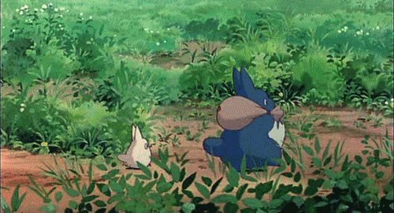
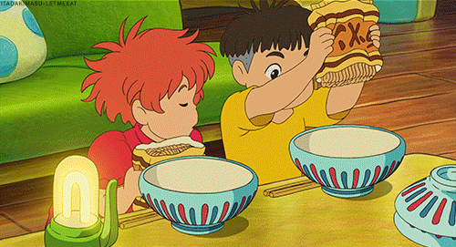

<h2 align="center" style="font-family: 'Courier New', monospace;">greetings! 🐀</h2>

welcome to the rat den~ home to a lost computing & law major, aspiring legal technologist, failing artist, and coffee addict.

</img>

want to find out what goes on in the mind of a rat? <a href="https://kevanweeportfolio.vercel.app/">check this out!</a>

<button type="button" onclick="window.location.href='https://kevanweeportfolio.vercel.app/'">explore</button>

<h2 style="font-family: 'Courier New', monospace;">what's cooking? 🍳</h2>

probably some nissin laksa and a cup of instant coffee...

</img>

jokes aside.. a wise man once said "anyone can cook" 👨‍🍳 
i build everything and anything! (see the next section for my areas of interest :D)
  
my recent projects involve a discord chatbot for singapore tort law doctrines and a webscraper to find prices from popular sites 📖

<button type="button" onclick="alert('stay tuned for more projects!')">projects</button>

<h2 style="font-family: 'Courier New', monospace;">what cuisines do you specialise in? 🥐</h2>

as someone studying both computing and law, i suffer from every conceivable "jack of all trades" stereotype but i primarily specialise in legaltech product management and digital transformation 👨‍💻 
(think video game where you refuse to pick a class and unlock skills in every tree 🗡)

</img>

so what other trades does this jack have?  

<table align="center" style="font-family: 'Courier New', monospace; border-collapse: collapse; width: 80%;">
<thead>
<tr>
<th align="left">skill</th>
<th align="left">description</th>
</tr>
</thead>
<tbody>
<tr>
<td>🛠 legaltech</td>
<td>e-discovery, aml/kyc-ctf, doc management, practice management</td>
</tr>
<tr>
<td>⚖️ law</td>
<td>both civil and criminal</td>
</tr>
<tr>
<td>🤖 ai</td>
<td>rag (retrieval-augmented generation)</td>
</tr>
<tr>
<td>🌐 web dev</td>
<td>html, css</td>
</tr>
<tr>
<td>🐍 scripting</td>
<td>python, js, php</td>
</tr>
<tr>
<td>📡 network administration</td>
<td>network setup and maintenance</td>
</tr>
<tr>
<td>🎨 3d design</td>
<td>modeling and rendering projects</td>
</tr>
<tr>
<td>🔍 intelligence analysis</td>
<td>imint, geoint, osint techniques</td>
</tr>
<tr>
<td>🗺️ gis & cartography</td>
<td>arcgis products, qgis, global mapper, geospatial data production</td>
</tr>
<tr>
<td>📷 stereophotogrammetry & geomatics</td>
<td>georectification, orthorectification, mosaicing processes</td>
</tr>
<tr>
<td>🎮 game dev</td>
<td>unity-based development projects </td></tr></tbody></table>

<button type= retro!
