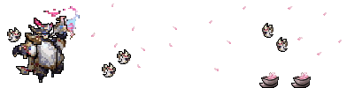
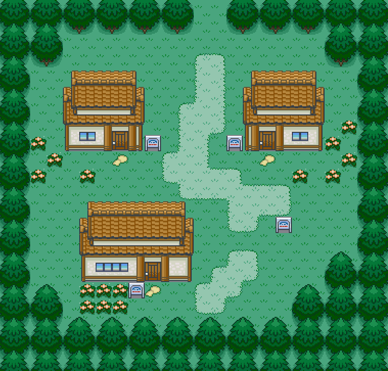
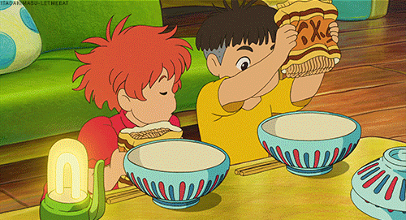
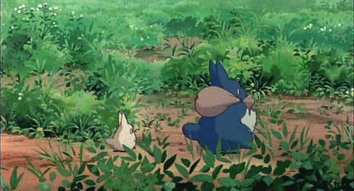
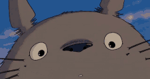
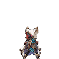



  

 

  <strong>welcome to the rat den 🐀</strong>

  <em>computing &amp; law major &nbsp;·&nbsp; aspiring legal technologist &nbsp;·&nbsp; ex cartographer &nbsp;·&nbsp; intelligence practitioner &nbsp;·&nbsp; failing artist &nbsp;·&nbsp; coffee addict</em>

  
  &nbsp;
  
  &nbsp;
  

  

 

---

  
<h2>🍜 &nbsp;what's cooking? &nbsp;</h2>

   

  

    
  

   

  

    probably some nissin laksa and a cup of instant coffee...
      
    a wise rat once said <em>"anyone can cook"</em> 👨‍🍳 — i build everything and anything!
      
    recent brews: a copyright infringement triage tool, a contract harmonisation tool, 
    a parliamentary debate scraper, and too many other wip experiments 🛠️
  

  

    
    &nbsp;
    
    &nbsp;
    
  

   

---

  
<h2>🍳 &nbsp;what cuisines do you specialise in? &nbsp;</h2>

   

  

    
  

   

  

    as someone studying both computing and law, i suffer from every conceivable <em>"jack of all trades"</em> stereotype 
    but i primarily specialise in <strong>legaltech product management and digital transformation</strong> 👨‍💻 
    <em>(think video game where you refuse to pick a class and unlock skills in every tree 🗡️)</em>
  

   

  

  | 🖥️ **tech** | |
  |:---|:---|
  | 🌐 web dev | html, css, typescript |
  | 🐍 scripting | python, java, js, php |
  | 🛢️ dbms | mysql |
  | 📡 network administration | server setup, ztna |
  | 🤖 ai | rag, openai api, vector search, similarity scoring |
  | 🎨 3d design | blender |
  | 🌎 gis | arcgis products, qgis, global mapper, geospatial data production |
  | 🎮 game dev | unity-based development (but it's been a decade 😭) |

  

  

  | 📚 **others** | |
  |:---|:---|
  | 🛠️ legaltech | e-discovery, aml/kyc-ctf, doc management, practice management |
  | ⚖️ law | civil (contract, torts, family, ip, corporate) & criminal — leaning towards ip and data privacy |
  | 🔍 intelligence analysis | imint, geoint, osint |
  | 🗺️ cartography | topographic maps, orthoimage maps, situation maps (disaster relief/change assessment) |
  | 📷 geomatics | georectification, orthorectification, mosaicing, stereophotogrammetry |

  

   

  

    
    
    
    
    
    
    
    
    
    
    
  

   

---

  
<h2>🍽️ &nbsp;what recipes have you come up with? &nbsp;</h2>

   

  
here's some of the dishes i've made recently! (and some works in progress) 🍽️🛠️

   

  

  **🛠️ legal technology ⚖️**

  | project | description |
  |:---|:---|
  | [copycat](https://github.com/kevanwee/copycat) | 🐈 singapore-first copyright infringement triage tool with deterministic similarity scoring |
  | [sightstone](https://github.com/kevanwee/sightstone) | 📋 contract playbook harmonisation tool |
  | [sal citation generator *(wip)*](https://github.com/kevanwee/sal-citation-generator) | 📝 footnote generator using the sal style guide |
  | [eliti scraper](https://github.com/kevanwee/elitiscraper) | 🧹 elitigation sghc/sgca judgment scraper using beautifulsoup4 |
  | [sg statute scraper *(wip)*](https://github.com/kevanwee/sgstatutescraper) | 📜 singapore statutes online scraper using beautifulsoup |
  | [hansard scraper *(wip)*](https://github.com/kevanwee/hansardscraper) | 🏛️ singapore parliamentary debate scraper using beautifulsoup |
  | [lex lynx](https://github.com/kevanwee/lexlynx) | 🦁 openai wrapper that summarizes case law |
  | [tort rat](https://github.com/kevanwee/tortrat) | 🐀 discord chatbot for sg tort law |
  | [codeoflaw *(wip)*](https://github.com/kevanwee/codeoflaw) | 📊 statistical analysis on all reported sghc and sgca judgments |
  | [crimewatch *(wip)*](https://github.com/kevanwee/crimewatch) | 👀 heatmap analysis on locations mentioned in sg criminal law judgments |

  

  

  **🗺️ intelligence analysis tools 🧠**

  | project | description |
  |:---|:---|
  | [hawk shot](https://github.com/kevanwee/hawkshot) | 🦅 line-of-sight / viewshed analysis tool |
  | [map mole](https://github.com/kevanwee/mapmole) | 🕵️ satellite imagery change detection |

  

  

  **🎨 art**

  | project | description |
  |:---|:---|
  | [lol pixel art](https://github.com/kevanwee/lolpixelart) | 🖌️ pixel art for league of legends skins |

  

  

  **✨ others**

  | project | description |
  |:---|:---|
  | [the office](https://github.com/kevanwee/theoffice) | 🏢 vs code extension — animated pokémon characters that follow your ai agents as they code |
  | [kevanwee portfolio](https://github.com/kevanwee/kevanwee) | 🌐 this static portfolio site |
  | [3d portfolio](https://github.com/kevanwee/kevanweeportfolio) | 📦 javascript-based website that displays 3d objects |
  | [book worm](https://github.com/kevanwee/bookworm) | 📚 book price scraper — amazon, kinokuniya, thryft |
  | [huhh](https://github.com/kevanwee/HUHH) | 😂 an april fools joke |

  

   

---

 

  

 

---

 

<h2 align="center">contacts! &nbsp;</h2>

  

  want to talk about anything across tech, law and art?
    
  📧 email me at <a href="mailto:kevan.wee.2023@scis.smu.edu.sg">kevan.wee.2023@scis.smu.edu.sg</a>
   
  🔗 connect with me: &nbsp;<a href="https://www.linkedin.com/in/kevanwee/">linkedin</a> &nbsp;·&nbsp; <a href="https://www.instagram.com/kwjw30/">instagram</a>
   
  🎨 art accounts: &nbsp;<a href="https://www.instagram.com/van.fullofkebabs/">instagram</a> &nbsp;·&nbsp; <a href="https://www.tiktok.com/@seofon30">tiktok</a>
    
  feel free to reach out!
    
  

