

  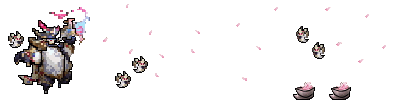

 

  <picture><source media="(prefers-color-scheme: dark)" srcset="./readme/art/header-dark.svg" /></picture>

  
  &nbsp;
  
  &nbsp;
  

  <a href="#cooking"><picture><source media="(prefers-color-scheme: dark)" srcset="./readme/art/nav-cooking-dark.svg" />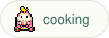</picture></a>
  <a href="#cuisines"><picture><source media="(prefers-color-scheme: dark)" srcset="./readme/art/nav-cuisines-dark.svg" />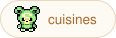</picture></a>
  <a href="#recipes"><picture><source media="(prefers-color-scheme: dark)" srcset="./readme/art/nav-recipes-dark.svg" /></picture></a>
  <a href="#contacts"><picture><source media="(prefers-color-scheme: dark)" srcset="./readme/art/nav-contacts-dark.svg" />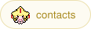</picture></a>

  

  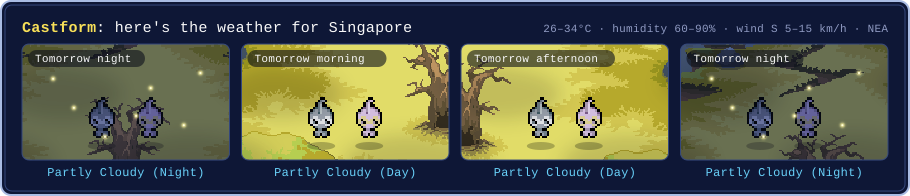

  <picture><source media="(prefers-color-scheme: dark)" srcset="./readme/art/contribution-garden-dark.svg" /></picture>



  
<picture><source media="(prefers-color-scheme: dark)" srcset="./readme/art/sign-cooking-dark.svg" /></picture> 

   

  

    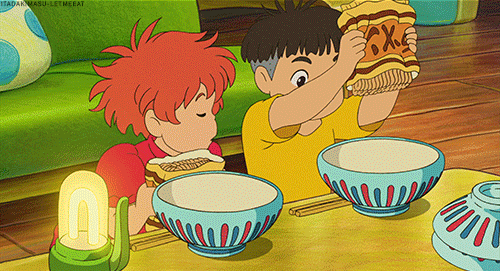
  

   

  

    <picture><source media="(prefers-color-scheme: dark)" srcset="./readme/art/note-cooking-dark.svg" /></picture>
  

  <!-- message log: recent public activity, regrown every two hours -->
  

    <a href="https://github.com/kevanwee?tab=overview"></a>
  

  

    
    &nbsp;
    
    &nbsp;
    
  

   



  
<picture><source media="(prefers-color-scheme: dark)" srcset="./readme/art/sign-cuisines-dark.svg" /></picture> 

   

  

    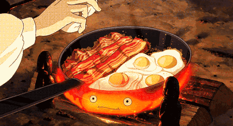
  

   

  

    <picture><source media="(prefers-color-scheme: dark)" srcset="./readme/art/note-cuisines-dark.svg" /></picture>
  

  

    <picture><source media="(prefers-color-scheme: dark)" srcset="./readme/art/trees-dark.svg" /></picture>
  

  

    
    
    
    
    
    
    
    
    
    
    
    
    
    
    
  

   



  
<picture><source media="(prefers-color-scheme: dark)" srcset="./readme/art/sign-recipes-dark.svg" /></picture> 

   

  
here's some of the dishes i've made recently! (and some works in progress) 🍽️🛠️

  

    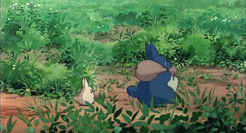
  

   

<h3 align="center">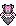 &nbsp;highlights</h3>

<a href="https://github.com/LegalQuants/lq-plugin-oss"><picture><source media="(prefers-color-scheme: dark)" srcset="./readme/art/card-lq-plugins-dark.svg" /></picture></a>
<a href="https://kevanwee.vercel.app/"><picture><source media="(prefers-color-scheme: dark)" srcset="./readme/art/card-bart-dark.svg" />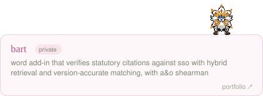</picture></a>
 
<a href="https://www.legalbenchmarks.ai/"><picture><source media="(prefers-color-scheme: dark)" srcset="./readme/art/card-legalbenchmarks-dark.svg" /></picture></a>
<a href="https://kevanwee.vercel.app/"><picture><source media="(prefers-color-scheme: dark)" srcset="./readme/art/card-voracity-dark.svg" /></picture></a>

<h3 align="center">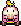 &nbsp;legal engineering toolkit</h3>

<a href="https://github.com/kevanwee/sg-legal-corpus"><picture><source media="(prefers-color-scheme: dark)" srcset="./readme/art/card-sg-legal-corpus-dark.svg" /></picture></a>
<a href="https://github.com/kevanwee/sg-deadline"><picture><source media="(prefers-color-scheme: dark)" srcset="./readme/art/card-sg-deadline-dark.svg" />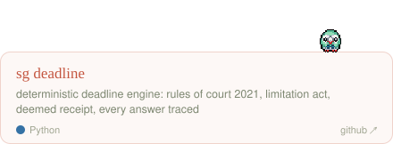</picture></a>
 
<a href="https://github.com/kevanwee/citecheck"><picture><source media="(prefers-color-scheme: dark)" srcset="./readme/art/card-citecheck-dark.svg" /></picture></a>
<a href="https://github.com/kevanwee/chronology"><picture><source media="(prefers-color-scheme: dark)" srcset="./readme/art/card-chronology-dark.svg" /></picture></a>
 
<a href="https://github.com/kevanwee/oblig-register"><picture><source media="(prefers-color-scheme: dark)" srcset="./readme/art/card-oblig-register-dark.svg" />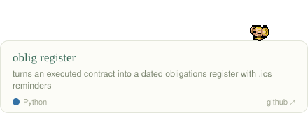</picture></a>
<a href="https://github.com/kevanwee/bundlebuild"><picture><source media="(prefers-color-scheme: dark)" srcset="./readme/art/card-bundlebuild-dark.svg" /></picture></a>
 
<a href="https://github.com/kevanwee/playbook-as-code"><picture><source media="(prefers-color-scheme: dark)" srcset="./readme/art/card-playbook-as-code-dark.svg" />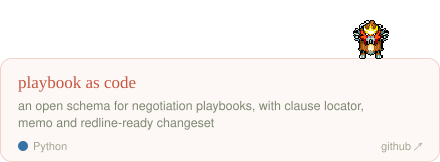</picture></a>
<a href="https://github.com/kevanwee/ipatlas"><picture><source media="(prefers-color-scheme: dark)" srcset="./readme/art/card-ipatlas-dark.svg" /></picture></a>
 
<a href="https://github.com/kevanwee/copycat"><picture><source media="(prefers-color-scheme: dark)" srcset="./readme/art/card-copycat-dark.svg" /></picture></a>
<a href="https://github.com/kevanwee/sightstone"><picture><source media="(prefers-color-scheme: dark)" srcset="./readme/art/card-sightstone-dark.svg" />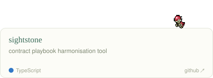</picture></a>
 
<a href="https://github.com/kevanwee/sal-citation-generator"><picture><source media="(prefers-color-scheme: dark)" srcset="./readme/art/card-sal-citation-generator-dark.svg" /></picture></a>
<a href="https://github.com/kevanwee/apac-lateral-tracker"><picture><source media="(prefers-color-scheme: dark)" srcset="./readme/art/card-apac-lateral-tracker-dark.svg" /></picture></a>

<h3 align="center"> &nbsp;legal data &amp; analytics</h3>

<a href="https://github.com/kevanwee/pdpcscraper"><picture><source media="(prefers-color-scheme: dark)" srcset="./readme/art/card-pdpcscraper-dark.svg" /></picture></a>
<a href="https://github.com/kevanwee/elitiscraper"><picture><source media="(prefers-color-scheme: dark)" srcset="./readme/art/card-elitiscraper-dark.svg" /></picture></a>
 
<a href="https://github.com/kevanwee/sgstatutescraper"><picture><source media="(prefers-color-scheme: dark)" srcset="./readme/art/card-sgstatutescraper-dark.svg" /></picture></a>
<a href="https://github.com/kevanwee/hansardscraper"><picture><source media="(prefers-color-scheme: dark)" srcset="./readme/art/card-hansardscraper-dark.svg" />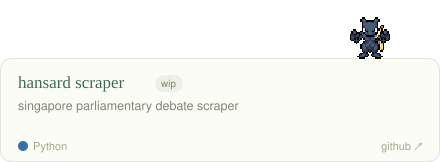</picture></a>
 
<a href="https://github.com/kevanwee/codeoflaw"><picture><source media="(prefers-color-scheme: dark)" srcset="./readme/art/card-codeoflaw-dark.svg" /></picture></a>
<a href="https://github.com/kevanwee/crimewatch"><picture><source media="(prefers-color-scheme: dark)" srcset="./readme/art/card-crimewatch-dark.svg" /></picture></a>
 
<a href="https://github.com/kevanwee/justicegap"><picture><source media="(prefers-color-scheme: dark)" srcset="./readme/art/card-justicegap-dark.svg" />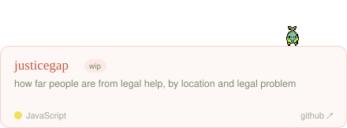</picture></a>
<a href="https://github.com/kevanwee/lexlynx"><picture><source media="(prefers-color-scheme: dark)" srcset="./readme/art/card-lexlynx-dark.svg" />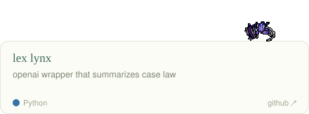</picture></a>
 
<a href="https://github.com/kevanwee/tortrat"><picture><source media="(prefers-color-scheme: dark)" srcset="./readme/art/card-tortrat-dark.svg" /></picture></a>

<h3 align="center">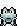 &nbsp;intelligence analysis tools</h3>

<a href="https://github.com/kevanwee/hawkshot"><picture><source media="(prefers-color-scheme: dark)" srcset="./readme/art/card-hawkshot-dark.svg" /></picture></a>
<a href="https://github.com/kevanwee/mapmole"><picture><source media="(prefers-color-scheme: dark)" srcset="./readme/art/card-mapmole-dark.svg" />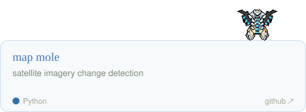</picture></a>

<h3 align="center">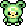 &nbsp;art</h3>

<a href="https://github.com/kevanwee/lolpixelart"><picture><source media="(prefers-color-scheme: dark)" srcset="./readme/art/card-lolpixelart-dark.svg" /></picture></a>

<h3 align="center">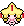 &nbsp;others</h3>

<a href="https://github.com/kevanwee/voracity-watcher"><picture><source media="(prefers-color-scheme: dark)" srcset="./readme/art/card-voracity-watcher-dark.svg" />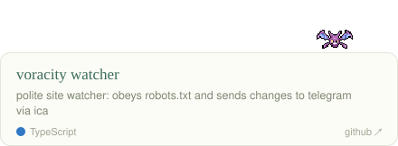</picture></a>
<a href="https://github.com/kevanwee/theoffice"><picture><source media="(prefers-color-scheme: dark)" srcset="./readme/art/card-theoffice-dark.svg" /></picture></a>
 
<a href="https://github.com/kevanwee/pmdsvgworld"><picture><source media="(prefers-color-scheme: dark)" srcset="./readme/art/card-pmdsvgworld-dark.svg" /></picture></a>
<a href="https://github.com/kevanwee/kevanwee"><picture><source media="(prefers-color-scheme: dark)" srcset="./readme/art/card-kevanwee-dark.svg" /></picture></a>
 
<a href="https://github.com/kevanwee/kevanweeportfolio"><picture><source media="(prefers-color-scheme: dark)" srcset="./readme/art/card-kevanweeportfolio-dark.svg" />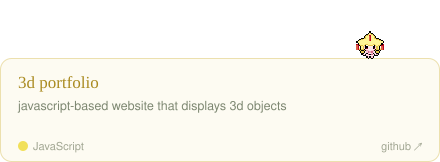</picture></a>
<a href="https://github.com/kevanwee/bookworm"><picture><source media="(prefers-color-scheme: dark)" srcset="./readme/art/card-bookworm-dark.svg" />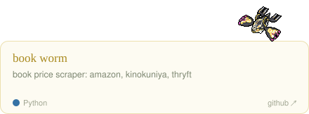</picture></a>
 
<a href="https://github.com/kevanwee/HUHH"><picture><source media="(prefers-color-scheme: dark)" srcset="./readme/art/card-huhh-dark.svg" />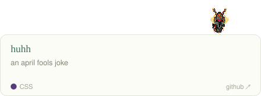</picture></a>

   



  <picture><source media="(prefers-color-scheme: dark)" srcset="./readme/art/playground-dark.svg" /></picture>

  



<picture><source media="(prefers-color-scheme: dark)" srcset="./readme/art/sign-contacts-dark.svg" /></picture>

  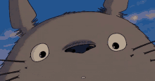

  <picture><source media="(prefers-color-scheme: dark)" srcset="./readme/art/note-contacts-dark.svg" /></picture>

  <a href="mailto:kevan.wee.2023@scis.smu.edu.sg"><picture><source media="(prefers-color-scheme: dark)" srcset="./readme/art/contact-email-dark.svg" />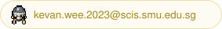</picture></a>
  <a href="https://www.linkedin.com/in/kevanwee/"><picture><source media="(prefers-color-scheme: dark)" srcset="./readme/art/contact-linkedin-dark.svg" />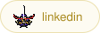</picture></a>
  <a href="https://www.instagram.com/kwjw30/"><picture><source media="(prefers-color-scheme: dark)" srcset="./readme/art/contact-instagram-dark.svg" />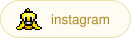</picture></a>
  <a href="https://www.instagram.com/van.fullofkebabs/"><picture><source media="(prefers-color-scheme: dark)" srcset="./readme/art/contact-art-instagram-dark.svg" />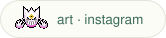</picture></a>
  <a href="https://www.tiktok.com/@seofon30"><picture><source media="(prefers-color-scheme: dark)" srcset="./readme/art/contact-tiktok-dark.svg" />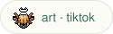</picture></a>

  

  sprites by the <a href="https://sprites.pmdcollab.org/">PMD Sprite Collab</a> contributors · item icons via <a href="https://github.com/PokeAPI/sprites">PokeAPI</a> ·
  mega evolution symbol by pixelthecollector · drawn and regrown daily by <a href="./genpokemon/readme_art">genpokemon/readme_art</a>

