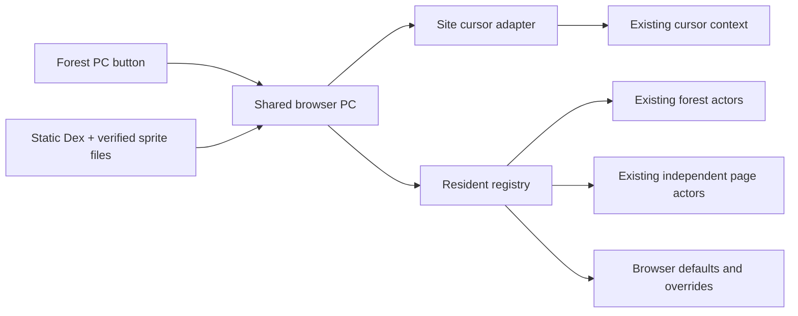
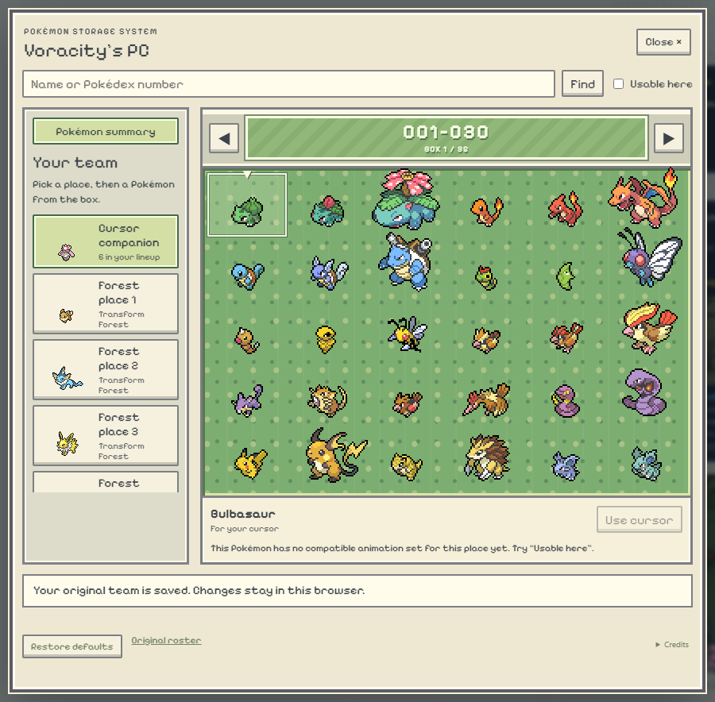
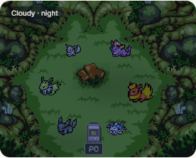

# Pokémon PC

The cabinet at the bottom of Transform Forest opens a main-series-style storage
screen: cream frame, green 6 × 5 boxes, native pixel icons, National Dex navigation,
search and forms. **Build team occupies the left column**; the box remains on the
right. On phones the team scrolls above the box. The cabinet is original pixel SVG,
with a keyboard/touch button and a reserved footprint in forest pathfinding.

## Defaults first

`public/pokemon-pc/defaults-v1.json` preserves the original source roster, cursor
lineup and form defaults, maps and mascot definitions. The additive
`embedded-defaults-v1.json` inventories embedded asset references, including fixed
mascots. Neither is overwritten by the builder. The Voracity snapshot includes the
owner's current Squirtle/Treecko Explorer team even while that separate change is
uncommitted. The PC does not replace the original roster generators.

Before the first PC edit, an immutable browser backup records the existing cursor
lineup, selected cursor, Mega/fusion preferences and native registered residents.
If saving it fails, edits are blocked. Restore defaults removes only PC overrides
and restores that cursor backup. A page visit retains its resident identities,
positions and population. New visits still draw the original random roster; saved
PC choices apply to matching resident identities and stable forest places.

## What can change

- Cursor companions already supported by the site's cursor renderer.
- Six forest places, using existing compatible ground Idle/Walk/Sleep sheets.
- Independent page residents, restricted to compatible ground/flying animation sets.

The full 1,025-species base Dex is browsable. **Usable here** filters the actual
compatible choices. This does not add 1,025 animated residents. Search pairs,
bonded companions and residents with special page roles keep those roles; fixed
mascots, forecast forms and Route 111/Mauville populations are preserved. The
portfolio's other Friend Areas retain their native visitor logic; their navigation
offers a return to the PC in Transform Forest.

## Architecture



`src/pokemon/pc` is the canonical vendored browser module, mirrored byte-for-byte
in the portfolio's `src/components/pc`. `PokemonPcHost` is site-specific. No VS Code
extension code, private agent logs, filesystem APIs or provider hooks enter the
browser. Voracity namespaces resident preferences by the **notes owner** (or local
mode), not Google app identities. Scope changes invalidate pending loads. The
portfolio uses its own browser namespace. There is no new Firestore collection,
sync service, billing or infrastructure. Existing cursor persistence is retained.

Duplicate normal/expanded forest views share choices. Loading is staged before
changes; failed loads/writes preserve the resident. Unmount, account switch,
restore and newer selections prevent stale asynchronous work overwriting a choice.
Native dialogs preserve focus, make the page inert and work with reduced motion.

## Assets and maintenance

Box icons/front sprites retain the pinned PokeAPI source URLs and SHA-256 receipts;
SpriteCollab credits list individual contributors/forms and the pinned revision.
Type metadata carries its PokeAPI BSD-3-Clause source. The font is Pixelify Sans
(SIL OFL). Toastypk/Pamtre Berry retain the existing Transform Forest credit.
The PC is an unofficial, non-commercial fan feature, unaffiliated with Nintendo,
Creatures, GAME FREAK, The Pokémon Company or Spike Chunsoft. Original game artwork
remains its owners' property; provenance and fan notices do not grant an artwork
redistribution licence. Existing site notices and SpriteCollab CC BY-NC 4.0 remain.

To rebuild from the owner's verified cache:

```powershell
node scripts/build-pokemon-pc.mjs . <pack-directory> [second-verified-pack]
node scripts/build-pokemon-pc.mjs <portfolio-directory> <pack-directory> [second-verified-pack]
node scripts/sync-pokemon-pc.mjs <portfolio-directory>
node scripts/build-palette.mjs --write
```

Runtime needs only the committed static files. The build step refuses unreceipted
or hash-mismatched cache files and never overwrites default snapshots. The optional
second cache supplies missing receipts from older concurrent imports.

Validation: both production builds; Voracity unit suite; forest/world simulations;
browser checks for backup/restore, reload persistence, left/right placement, 320px
layout, cursor selection and the portfolio's normal/expanded forest instances.
No production deployment is included.

## Preview

Shared storage UI shown in Voracity (the portfolio uses its own name and namespace):




